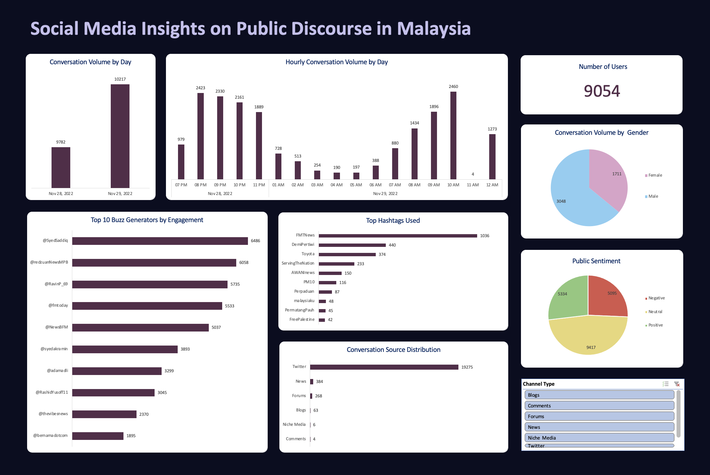

# Social Media Insights Dashboard (Excel)

This project presents an Excel-based dashboard built to analyze and visualize trends from a dataset of social media conversations. It demonstrates how to transform raw data into actionable insights using Excel tools such as Power Query, PivotTables, and slicers.

## 🖼️ Dashboard Preview

## 📊 Dashboard Features

- **Daily & Hourly Trend Analysis**  
  Visualizes the volume of online mentions over time to identify conversation peaks and drops.

- **Sentiment Breakdown**  
  Categorizes conversations into positive, neutral, or negative sentiment.

- **Source Distribution**  
  Shows which platforms (e.g., Twitter, News, Forums) drove the most engagement.

- **Influencer Impact**  
  Highlights top accounts contributing to the buzz.

- **Unique User Count**  
  Calculates the number of distinct users involved in the discussion.

- **Hashtag Frequency**  
  Identifies the most commonly used hashtags in the dataset.

- **Gender Estimation**  
  Uses simple name-based heuristics to approximate gender distribution.

- **Channel Type Slicer**  
  An interactive slicer allows users to filter the entire dashboard by channel type.

## 🧠 Tools Used

- Excel PivotTables & PivotCharts  
- Power Query (data cleaning, transformation, merging)  
- Formula-based flags (for unique users, timestamp parsing)  
- Slicers for interactive filtering

## 📁 Files

- `social_media_dashboard.xlsx` – Main Excel file containing all visuals, tables, and slicers

---
